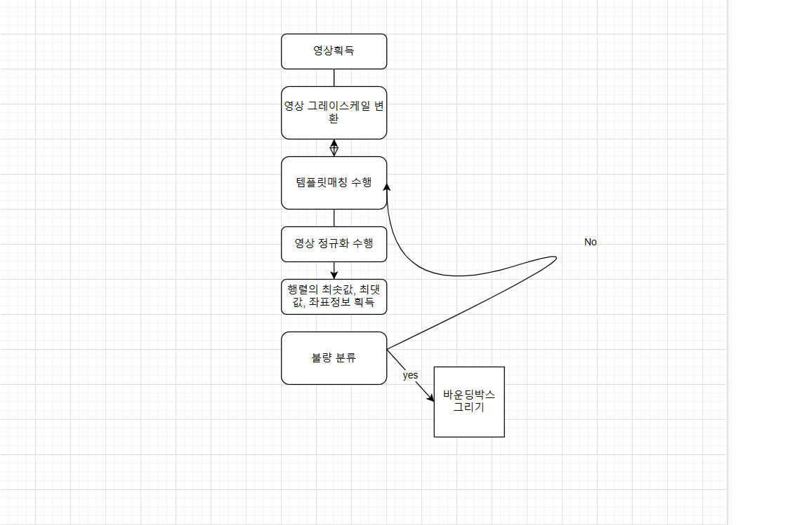
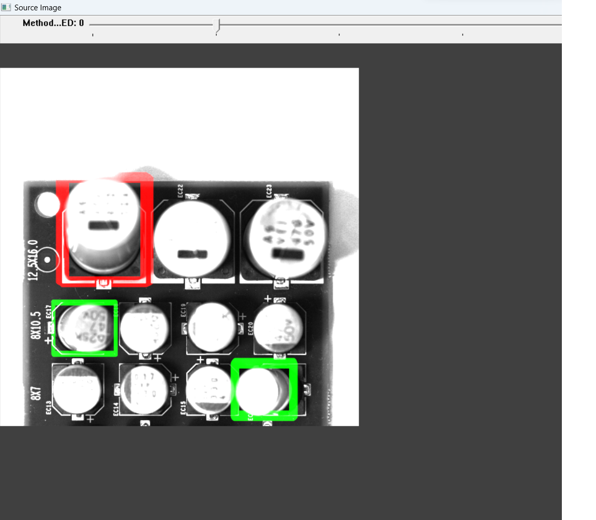
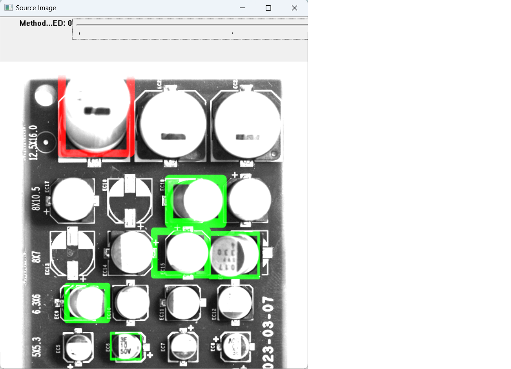

# PCB기판 위 커패시터 기울어진 불량을 분류하는 시스템

-   개발환경

    -   Visual Studio 2022
    -   OpenCV 4.7.0
    -   C++ 14

-   데이터셋

    -   Template Image 및 Source Image (PCB 기판)

-   순서도
    -   

 
 

-   결과물

    -   
    -   
